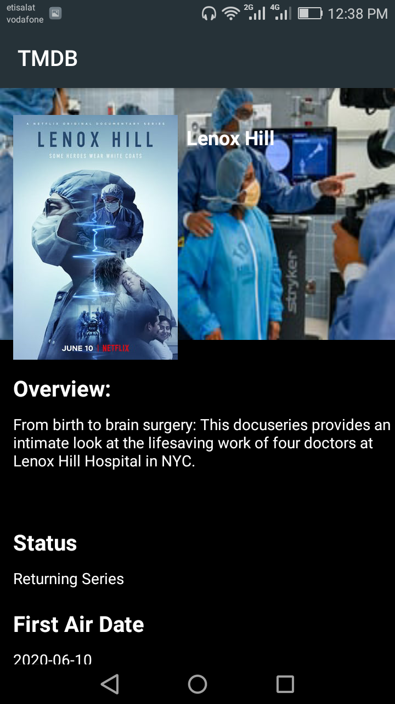

# TMDB
This is an android application that shows Lists of movies, Tv Shows and details of each movie and tv show 
with the help of TMDB (The Movie DataBase) API.

## Features
- Discover Popular, Top Rated and Now Playing movies on TMDb.
- View movie details like release date, rating, tagline and overview inside the app.
- Discover popular, Top Rated, on TV and Airing today TV shows.
- view Tv show details like release date, rating, tagline and overview inside the app.

## Architecture and Tech features
- Fully written in Kotlin language.
- Built on MVVM architecture pattern.
- Uses Android Architecture Components, specifically ViewModel and LiveData.
- Uses Retrofit for making API calls.
- Uses Picasso for image loading.

## Screenshots




## Configuration
In order to run this application, you need to get your own key from TMDb. You can do that by clicking [here](https://www.themoviedb.org/account/signup).

After you get an API key, put that key in ```gradle.properties``` file as follows:
```
API_KEY=your_key_api
```
## TODO
- [ ] Works offline by caching data into a database.
- [ ] using Fragments in this app.
- [ ] UI Improvements espicaially movie and TV show details screens.
